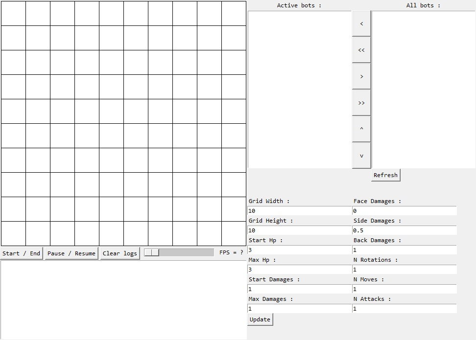
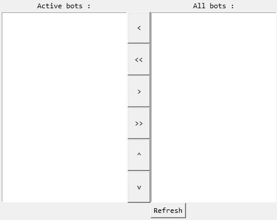
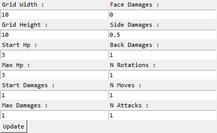

# Python-Bot-Fight-Arena


This is an Arena in which you can add bots you have coded to see them fight.
## Features
- Logs of the fight
- Ajustment of the fight parameters
## Installation
1. Download the repository by clicking on `Code > Download ZIP`
2. Extract the ZIP file
3. Run `main.pyw`
## Requirements
- Python 3.7
- Python `tkinter` library
- Python `importlib` library
- Python `sys` library
- Python `os` library
- Python `random` library
## Usage
First of all you have to create bots. Bots files have to be place in the `Bots` folder and contain a class named `Bot`.

`example.py`
```Python
class Bot:
    def __init__(self):
        # Your code...

    def init(self, arena_infos, bot_stats):
        """Called at the beginning of a fight
        
        Parameters
        ----------
        arena_infos : dict
            A dict representing the arena infos
        bot_stats : dict
            A dict representing the bot stats
        
        Returns
        -------
        None
        """
        # Your code...

    def run(self, bot_stats, others_stats):
        """Called when it's the bot turn

        Parameters
        ----------
        bot_stats : dict
            A dict representing the bot stats
        others_stats : list
            A list of dict representing the opponents stats
        
        Returns
        -------
        str
            A string representing a list of actions separated by ';'
        """
        # Your code...
```

Structure of the arena infos dict :
```JSON
{
    "Width"       : "the width of the grid",
    "Height"      : "the height of the grid",
    "FaceDamages" : "the damages multiplier if the attack comes from the front",
    "SideDamages" : "the damages multiplier if the attack comes from the side",
    "BackDamages" : "the damages multiplier if the attack comes from the back",
    "NRotations"  : "the number of rotations that can be made in each round",
    "NMoves"      : "the number of moves that can be made in each round",
    "NAttacks"    : "the number of attacks that can be made in each round",
    "MaxHp"       : "the maximum number of HP a bot can have",
    "MaxDamages"  : "the maximum number of damages a bot can have",
    "Grid"        : "the arena grid (a two-dimensional array of integers 0 if there is a wall, 1 else)",
}
```

Structure of a bot stats dict :
```JSON
{
    "X"           : "the x coordinate of the bot",
    "Y"           : "the y coordinate of the bot",
    "Orientation" : "the orientation of the bot (0 for UP, 1 for RIGHT, 2 for DOWN and 3 for LEFT)",
    "Hp"          : "the bot HP",
    "Damages"     : "the bot damages",
}
```

The possible actions :
- `LEFT` : turn the bot left
- `RIGHT` : turn the bot right
- `FORWARD` : move forward 1 cell
- `ATTACK` : attack the cell behind the bot

After creating bots if you will be able to see them in this section :



You can move the bots throught the lists using the center buttons.

The bots placed into the "Active bots" list will be dropped in the next fight.

You can also ajust the fight parameters using this section :



Clicking on `Update` will apply the changes